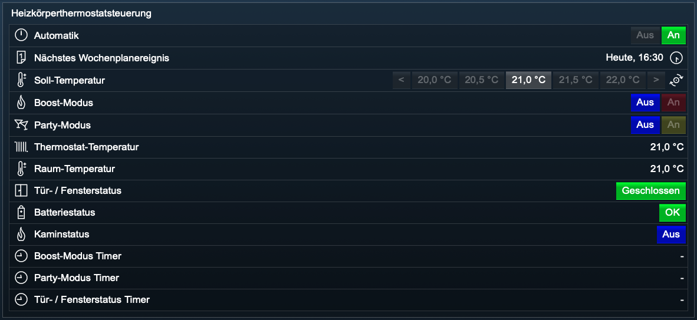
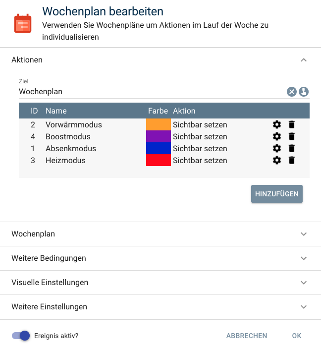

# Heizkoerperthermostatsteuerung

Integriert [HomeMatic](https://www.eq-3.de/start.html) und [Homematic IP](https://www.eq-3.de/start.html) Heizkörperthermostate in [IP-Symcon](https://www.symcon.de).

Unterstütze Heizkörperthermostate:

        * HM-CC-RT-DN
        * HmIP-eTRV
        * HmIP-eTRV-2
        * HmIP-eTRV-E

Für dieses Modul besteht kein Anspruch auf Fehlerfreiheit, Weiterentwicklung, sonstige Unterstützung oder Support.
Bevor das Modul installiert wird, sollte unbedingt ein Backup von IP-Symcon durchgeführt werden.
Der Entwickler haftet nicht für eventuell auftretende Datenverluste oder sonstige Schäden.
Der Nutzer stimmt den o.a. Bedingungen, sowie den Lizenzbedingungen ausdrücklich zu.

Zur Verwendung dieses Moduls als Privatperson, Einrichter oder Integrator wenden Sie sich bitte zunächst an den Autor.

### Inhaltsverzeichnis

1. [Heizkoerperthermostatsteuerung](#1-heizkoerperthermostatsteuerung)
2. [Wochenplan](#2-wochenplan)
3. [Logik](#3-logik)
4. [PHP-Befehlsreferenz](#4-php-befehlsreferenz)

### 1. Heizkoerperthermostatsteuerung  

[]()  

### 2. Wochenplan

[]()

Folgende ID Reihenfolge muss unbedingt eingehalten werden.

* ID 1: Absenkmodus
* ID 2: Vorwärmmodus
* ID 3: Heizmodus
* ID 4: Boostmodus

Der Name der Aktion kann frei gewählt werden und hat keinen Einfluss auf die Steuerung.


### 3. Logik

* #### Automatik:

    * Die Automatik kann `Aus`, bzw. `An` geschaltet werden.

        * Automatik `Aus`: `Manuelle Steuerung`, der Wochenplan wird nicht berücksichtigt.

        * Automatik `An`: Das Thermostat wird in den manuellen Modus versetzt und der zugewiesene und aktivierte `Wochenplan wird gemäß Konfigurationseinstellung berücksichtigt`.

* #### Tür- / Fensterstatus:

    * Sofern in der Instanzkonfiguration Tür- und Fenstersensoren aktiviert sind, so wird der Status der Türen und Fenster überprüft.

    * Sind keine Tür- und Fenstersensoren aktiviert, so bleibt der Tür- / Fensterstatus immmer auf `Geschlossen` und kann ggfs. ausgeblendet werden.

    * Die finale Feststellung, ob alle Türen oder Fenster geschlossen sind, bzw. mindestens eine Tür oder ein Fenster geöffnet ist, erfolgt immer erst nach der vorgegebenen Überprüfungszeit.

        * Tür- / Fensterstaus `Geschlossen`: Die Soll-Temperatur wird am Heizkörper-Thermostat gesetzt.

        * Tür- / Fensterstaus `Geöffnet`: Sofern eine Absenkung der Temperatur erfolgen soll, so wird die Absenktemperatur am Heizkörper-Thermostat gesetzt.

        * Tür- / Fensterstaus `Geöffnet` und Boost-Modus `An`: Der Boost-Modus wird ausgeschaltet.

* #### Soll-Temperatur:

    * Die Soll-Temperatur ergibt sich aus der Aktion des Wochenplans, sofern die `Automatik An` und der `Wochenplan aktiv` ist.

    * Wird eine Aktion aus dem Wochenplan aktiv, wird die zugehörige Temperatur nur am Heizkörper-Thermostat gesetzt, wenn der `Tür- / Fensterstatus Geschlossen` ist und der `Boost-Modus Aus`ist.

    * Eine manuelle Veränderung der Soll-Temperatur durch den Anwender ändert ebenfalls die Soll-Temperatur, auch bei `Tür- / Fensterstaus Geöffnet` und bei `Boost-Modus Aus`.

    * Die neue Soll-Temperatur wird am Heizkörper-Thermostat gesetzt.

    * Ein manuelles Einstellen der Temperatur direkt am Heizkörper-Termostat mittels Stellrad `verändert` die Soll-Temperatur bei `Automatik An nicht`.

* #### Boost-Modus:

    * Der Boost-Modus kann `Aus`, bzw. `An` geschaltet werden.

        * Boost-Modus `Aus`: Die `Soll-Temperatur wird am Heizkörper-Thermostat gesetzt`.

        * Boost-Modus `An` und Tür- / Fensterstatus `Geschlossen`: Der Boost-Modus wird `An` geschaltet. Die definierte Boost-Temperatur wird für den definierten Boost-Zeitruam am Heizkörper-Thermostat gesetzt.

        * Boost-Modus `An` und Tür- / Fensterstatus `Geöffnet`: Der Einschaltvorgang wird `abgebrochen`.

    * Wird der Boostmodus mittels Wochenplan gesetzt, so wird die Boost-Temperatur am Heizkörper-Thermostat gesetzt, der `Boost-Modus Schalter bleibt unverändert`.

* #### Party-Modus:

    * Der Party-Modus kann `Aus`, bzw. `An` geschaltet werden.

        * Party-Modus `Aus`: Es wird die aktuelle Aktion gemäß Wochenplan gepüft und ausgeführt. Die ermittelte `Soll-Temperatur wird am Heizkörper-Thermostat gesetzt`.

        * Party-Modus `An` : Der Party-Modus wird für die nächsten 24 Stunden `An` geschaltet. Der Wochenplan wird für diesen Zeitraum nicht berücksichtigt.

* #### Thermostat-Temperatur:

    * Die Thermostat-Temperatur ist die derzeit eingestellte Temperatur am Heizkörper-Thermostat.

    * Ein `manuelles Einstellen` der Temperatur direkt am Heizkörper-Termostat mittels Stellrad `verändert die Thermostat-Temperatur`, `die Soll-Temperatur bleibt unverändert bei Automatik An`.

* #### Raum-Temperatur:

    * Die Raum-Temperatur zeigt die aktuelle Temperatur im Raum an.

### 4. PHP-Befehlsreferenz

Temperatur des Heizkörperthermostats einstellen:

```text
UBHKTS_SetThermostatTemperature(float $Temperature);  

Die Funktion liefert keinerlei Rückgabewert.

Beispiel:

Temperatur auf 21,0 °C setzen:  
UBHKTS_SetThermostatTemperature(12345, 21.0);  
```