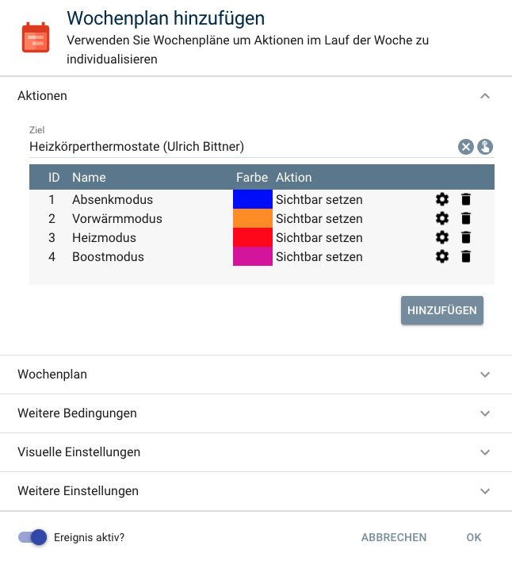

# Heizkoerperthermostatsteuerung

Integriert [HomeMatic](https://www.eq-3.de/start.html) und [Homematic IP](https://www.eq-3.de/start.html) Heizkörperthermostate in [IP-Symcon](https://www.symcon.de).

Unterstütze Heizkörperthermostate:

        * HM-CC-RT-DN
        * HmIP-eTRV
        * HmIP-eTRV-2
        * HmIP-eTRV-E

Für dieses Modul besteht kein Anspruch auf Fehlerfreiheit, Weiterentwicklung, sonstige Unterstützung oder Support.
Bevor das Modul installiert wird, sollte unbedingt ein Backup von IP-Symcon durchgeführt werden.
Der Entwickler haftet nicht für eventuell auftretende Datenverluste oder sonstige Schäden.
Der Nutzer stimmt den o.a. Bedingungen, sowie den Lizenzbedingungen ausdrücklich zu.

Zur Verwendung dieses Moduls als Privatperson, Einrichter oder Integrator wenden Sie sich bitte zunächst an den Autor.

### Inhaltsverzeichnis

1. [Heizkoerperthermostatsteuerung](#1-heizkoerperthermostatsteuerung)
2. [Wochenplan](#2-wochenplan)
3. [PHP-Befehlsreferenz](#3-php-befehlsreferenz)

### 1. Heizkoerperthermostatsteuerung  

[]()  

### 2. Wochenplan

[]()

### 3. PHP-Befehlsreferenz

Temperatur des Heizkörperthermostats einstellen:

```text
UBHKTS_SetThermostatTemperature(float $Temperature);  

Die Funktion liefert keinerlei Rückgabewert.

Beispiel:

Temperatur auf 21,0 °C setzen:  
UBHKTS_SetThermostatTemperature(12345, 21.0);  
```